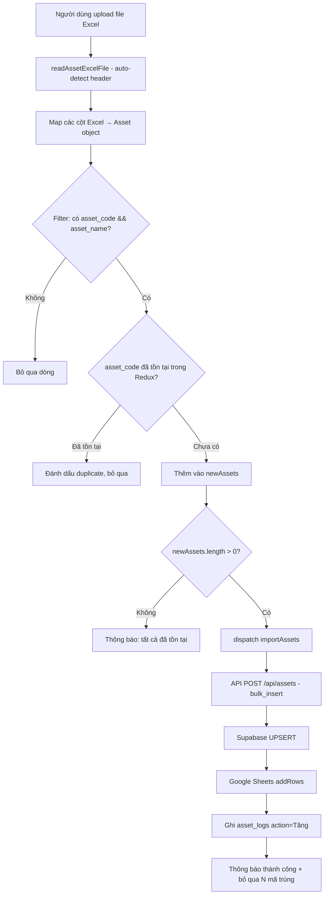
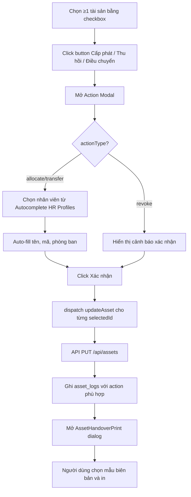
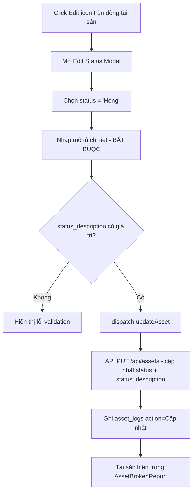

# TÀI LIỆU KỸ THUẬT PHÂN HỆ TÀI SẢN (ASSET MANAGEMENT)
**Ứng dụng hiện tại:** Anravity (React + Vite + Redux Toolkit + Supabase + Google Sheets)  
**Mục đích:** Phục vụ rewrite sang nền tảng Codex  
**Ngày trích xuất:** 31/05/2026  
**Trạng thái:** ✅ Đã xác minh từ source code | ⚠️ Cần kiểm tra thêm

---

## MỤC LỤC

1. [Tổng quan kiến trúc](#1-tổng-quan-kiến-trúc)
2. [Cấu trúc dữ liệu / Database](#2-cấu-trúc-dữ-liệu--database)
3. [API Endpoints & Luồng dữ liệu](#3-api-endpoints--luồng-dữ-liệu)
4. [State Management (Redux)](#4-state-management-redux)
5. [Phân quyền (RBAC)](#5-phân-quyền-rbac)
6. [Giao diện & Chức năng từng màn hình](#6-giao-diện--chức-năng-từng-màn-hình)
7. [Business Logic & Validation Rules](#7-business-logic--validation-rules)
8. [Quy trình nghiệp vụ (Workflows)](#8-quy-trình-nghiệp-vụ-workflows)
9. [Quan hệ Module & Dependency](#9-quan-hệ-module--dependency)
10. [Biên bản in ấn (Print Templates)](#10-biên-bản-in-ấn-print-templates)
11. [Tích hợp hệ thống ngoài](#11-tích-hợp-hệ-thống-ngoài)
12. [Phần cần kiểm tra / Suy luận thêm](#12-phần-cần-kiểm-tra--suy-luận-thêm)

---

## 1. TỔNG QUAN KIẾN TRÚC

### ✅ Stack công nghệ (xác minh từ `package.json`, `vite.config.ts`)

| Layer | Technology |
|---|---|
| Frontend | React 18 + TypeScript + Vite |
| UI Library | MUI (Material-UI) v6 |
| State | Redux Toolkit |
| Backend/API | Vercel Serverless Functions (TypeScript) |
| Database chính | Supabase (PostgreSQL) |
| Backup/Sync | Google Sheets (song song với Supabase) |
| Auth | Custom session (localStorage `qlkho_session`) |
| Routing | React Router v6 |
| Excel | ExcelJS |

### ✅ Kiến trúc dual-write

```
Frontend  →  Redux Action  →  API Serverless (/api/assets)
                                    ↓
                              Supabase (Primary) ─── THÀNH CÔNG → trả về
                                    ↓ (song song, non-blocking)
                              Google Sheets ─── THẤT BẠI → gs_sync_queue (Supabase)
```

> **Quan trọng cho migration:** Mọi thao tác CRUD đều ghi vào **cả Supabase và Google Sheets**. Google Sheets có timeout 3–4.5 giây; nếu timeout thì đưa vào hàng đợi `gs_sync_queue`.

---

## 2. CẤU TRÚC DỮ LIỆU / DATABASE

### ✅ Bảng `assets` — Bảng chính lưu tài sản

| Cột | Kiểu | Bắt buộc | Mô tả |
|---|---|---|---|
| `id` | UUID | ✅ | Primary Key (auto-generated) |
| `stt` | integer | - | Số thứ tự tự tăng (auto-increment theo max stt) |
| `asset_code` | string | ✅ | **Mã tài sản** — UNIQUE constraint |
| `asset_name` | string | ✅ | **Tên tài sản** |
| `asset_type_code` | string | - | Mã loại tài sản |
| `asset_type` | string | - | Loại tài sản (text) |
| `asset_group` | string | - | Nhóm tài sản (dùng để lọc CCDC / TBVP) |
| `asset_set` | string | - | Bộ tài sản |
| `quantity` | integer | - | Số lượng (default: 1) |
| `unit` | string | - | Đơn vị tính |
| `unit_price` | number | - | Đơn giá |
| `total_value` | number | - | Giá trị (= unit_price × quantity nếu tính toán) |
| `status` | string | - | **Tình trạng** (xem enum bên dưới) |
| `status_description` | string | - | Mô tả chi tiết tình trạng (bắt buộc khi status = 'Hỏng') |
| `manager_code` | string | - | Mã người quản lý |
| `manager_name` | string | - | Tên người quản lý |
| `management_unit_code` | string | - | Mã đơn vị quản lý |
| `management_unit_name` | string | - | Tên đơn vị quản lý |
| `location_code` | string | - | Mã vị trí tài sản |
| `location_name` | string | - | Vị trí tài sản |
| `receipt_date` | date (ISO) | - | Ngày nhận |
| `user_type` | string | - | Đối tượng sử dụng (chức vụ) |
| `user_employee_code` | string | - | **Mã nhân viên sử dụng** |
| `user_employee_name` | string | - | **Tên nhân viên sử dụng** |
| `user_department_code` | string | - | Mã phòng ban sử dụng |
| `user_department_name` | string | - | **Phòng ban sử dụng** |
| `representative_code` | string | - | Mã người đại diện |
| `representative_name` | string | - | Tên người đại diện |
| `first_use_date` | date (ISO) | - | Lần đầu sử dụng |
| `serial_number` | string | - | Số serial |
| `specifications` | string | - | Quy cách tài sản |
| `attached_components` | string | - | Linh kiện đính kèm |
| `maintenance_content` | string | - | Nội dung bảo dưỡng |
| `maintenance_basis` | string | - | Xác định bảo dưỡng theo |
| `maintenance_start_time` | date (ISO) | - | Thời điểm bắt đầu bảo dưỡng |
| `maintenance_cycle` | string | - | Bảo dưỡng lặp lại theo |
| `maintenance_start_capacity` | number | - | Công suất bắt đầu bảo dưỡng |
| `next_maintenance_after` | string | - | Bảo dưỡng lại sau |
| `origin` | string | - | Nguồn gốc |
| `supplier_code` | string | - | Mã nhà cung cấp |
| `supplier_name` | string | - | Tên nhà cung cấp |
| `purchase_date` | date (ISO) | - | Ngày mua |
| `contract_number` | string | - | Số hợp đồng |
| `notes` | string | - | Ghi chú |
| `depreciation_value` | number | - | Giá trị tính KH/PB |
| `depreciation_period` | string | - | Kỳ KH/PB |
| `depreciation_start_date` | date (ISO) | - | Ngày bắt đầu tính KH/PB |
| `accumulated_depreciation` | number | - | KH/PB lũy kế |
| `remaining_time` | string | - | Thời gian còn lại |
| `remaining_value` | number | - | Giá trị còn lại |
| `is_fixed_asset` | boolean | - | Là tài sản cố định |
| `brought_outside` | boolean | - | Mang ra ngoài |
| `is_shared_asset` | boolean | - | Là tài sản dùng chung |
| `asset_management_type` | string | - | Loại hình quản lý tài sản |
| `is_rented_asset` | boolean | - | Là tài sản thuê ngoài |
| `rented_type` | string | - | Loại thuê |
| `created_at` | timestamp | - | Tự động gán khi tạo |
| `updated_at` | timestamp | - | Tự động cập nhật |

**UNIQUE constraint:** `asset_code` — Dùng để `upsert` khi import Excel.

**Sắp xếp mặc định khi GET:** `ORDER BY stt ASC`

---

### ✅ Enum `status` (Tình trạng tài sản)

```
'Mới'            → Tài sản vừa nhập, chưa sử dụng
'Chưa sử dụng'   → Đã thu hồi, đang chờ cấp phát
'Đang sử dụng'   → Đang được sử dụng
'Đã cấp phát'    → Đã cấp phát cho nhân viên (sau action allocate)
'Đã điều chuyển' → Đã điều chuyển từ người này sang người khác
'Hỏng'           → Tài sản hỏng (yêu cầu status_description bắt buộc)
'Mất'            → Tài sản bị mất
'Thanh lý'       → Đã thanh lý
'Đang bảo dưỡng' → Đang được sửa chữa / bảo dưỡng
```

**Logic màu hiển thị:**
- `Hỏng` | `Mất` → chip màu **error** (đỏ)
- `Đã cấp phát` | `Đang sử dụng` → chip màu **success** (xanh)
- `Điều chuyển` → chip màu **warning** (vàng)
- Còn lại → chip màu **info** (xanh nhạt)

---

### ✅ Bảng `asset_logs` — Nhật ký biến động tài sản

| Cột | Kiểu | Mô tả |
|---|---|---|
| `id` | UUID | Primary Key |
| `asset_code` | string | Mã tài sản liên quan |
| `asset_name` | string | Tên tài sản |
| `asset_type` | string | Loại tài sản |
| `asset_group` | string | Nhóm tài sản |
| `action` | string | Loại thay đổi (xem enum bên dưới) |
| `details` | string | Mô tả chi tiết thay đổi |
| `employee_name` | string | Tên nhân viên liên quan |
| `employee_code` | string | Mã nhân viên liên quan |
| `department` | string | Phòng ban |
| `performed_by` | string | Người thực hiện (tên đăng nhập) |
| `created_at` | timestamp | Thời điểm ghi log |

**Enum `action` trong asset_logs:**
```
'Tăng'      → Nhập mới tài sản (POST)
'Giảm'      → Xóa tài sản (DELETE)
'Cấp phát'  → Cấp phát cho nhân viên (PUT: status='Đã cấp phát')
'Thu hồi'   → Thu hồi về kho (PUT: user_employee_name='')
'Điều chuyển' → Chuyển từ người A sang người B (PUT)
'Cập nhật'  → Cập nhật thông tin khác
```

---

### ✅ Bảng `asset_handovers` — Lịch sử biên bản bàn giao

| Cột | Kiểu | Mô tả |
|---|---|---|
| `id` | UUID | Primary Key |
| `employee_id` | string | Mã nhân viên (nullable, liên kết hr_profiles) |
| `receiver_name` | string | Tên người nhận |
| `receiver_title` | string | Chức vụ người nhận |
| `receiver_dept` | string | Đơn vị người nhận |
| `giver_info` | JSON object | Thông tin người giao (xem chi tiết bên dưới) |
| `template_type` | string | `'bhl'` hoặc `'default'` |
| `action_type` | string | `'allocate'` / `'revoke'` / `'transfer'` |
| `items` | JSON array | Danh sách tài sản / BHLĐ được bàn giao |
| `total_quantity` | number | Tổng số lượng |
| `created_by` | string | Tên người tạo biên bản |
| `created_at` | timestamp | Thời điểm tạo |

**Cấu trúc `giver_info` (JSON object):**
```json
{
  "giverName": "NGUYỄN HẢI SƠN",
  "giverTitle": "GĐ TTKV BSG",
  "giverPhone": "0988855186",
  "giverName2": "VÕ THANH SONG",
  "giverTitle2": "NV QLTS-KHO",
  "giverPhone2": "0988229082"
}
```

**Cấu trúc `items` khi `template_type='default'` (JSON array):**  
Mảng object Asset đã chọn (đủ các trường như bảng `assets`).

**Cấu trúc `items` khi `template_type='bhl'` (JSON array):**
```json
[
  { "name": "Dây đai bảo hiểm", "unit": "Chiếc", "quantity": 1, "serial": "...", "note": "..." },
  ...
]
```

---

### ✅ Bảng `gs_sync_queue` — Hàng đợi đồng bộ Google Sheets

| Cột | Kiểu | Mô tả |
|---|---|---|
| `table_name` | string | Tên bảng cần sync (`'assets'`, `'asset_logs'`, `'asset_handovers'`) |
| `action` | string | `'insert'` / `'update'` / `'delete'` |
| `payload` | JSON | Dữ liệu cần sync |
| `error_message` | string | Lý do thất bại |

---

## 3. API ENDPOINTS & LUỒNG DỮ LIỆU

### ✅ Endpoint chính: `/api/assets`

#### GET `/api/assets` — Lấy danh sách tài sản

```
1. Fetch từ Supabase: SELECT * FROM assets ORDER BY stt ASC
2. Nếu Supabase thất bại → Fallback sang Google Sheets
3. Trả về: Asset[]
```

#### GET `/api/assets?type=logs` — Lấy nhật ký biến động

```
SELECT * FROM asset_logs ORDER BY created_at DESC
Trả về: AssetLog[]
```

#### GET `/api/asset_handovers` — Lấy lịch sử biên bản bàn giao

```
SELECT * FROM asset_handovers ORDER BY created_at DESC
Trả về: AssetHandover[]
```

---

#### POST `/api/assets` — Thêm tài sản

**Request Body:**
```json
{
  "action": "insert" | "bulk_insert",
  "payload": Asset | Asset[],
  "performed_by": "Tên người thực hiện"
}
```

**Luồng xử lý:**
```
1. Sinh UUID cho từng item nếu chưa có
2. AUTO-INCREMENT stt: SELECT max(stt) FROM assets, nextStt = max+1
3. Xóa các field null/undefined/empty string trước khi insert
4. Supabase UPSERT (onConflict: 'asset_code', ignoreDuplicates: false)
5. Google Sheets addRow/addRows (timeout 4.5s)
   └─ Thất bại → gs_sync_queue
6. Ghi asset_logs với action='Tăng'
7. Trả về: Asset | Asset[]
```

**Phát hiện trùng lặp (client-side trước khi POST):**  
`filteredByExistingCodes = importedData.filter(a => !existingCodes.has(a.asset_code))`

---

#### PUT `/api/assets` — Cập nhật tài sản

**Request Body:**
```json
{
  "id": "uuid",
  ...updatedFields,
  "performed_by": "Tên người thực hiện"
}
```

**Luồng xử lý:**
```
1. Fetch old state: SELECT * FROM assets WHERE id = ?
2. Supabase UPDATE WHERE id = ?
3. Phân tích logic để xác định action log:
   ├─ status='Đã cấp phát'          → action='Cấp phát', details='Cấp phát cho: {newUser}'
   ├─ status='Đã điều chuyển'        → action='Điều chuyển', details='Từ [oldUser] sang [newUser]'
   ├─ user_employee_name=''          → action='Thu hồi', details='Thu hồi từ [oldUser] về kho'
   ├─ user_employee_name thay đổi   → action='Điều chuyển', details='oldUser → newUser'
   └─ Khác                           → action='Cập nhật'
4. Ghi asset_logs
5. Google Sheets: tìm row theo id, assign fields, save (timeout 3s)
   └─ Thất bại → gs_sync_queue
6. Trả về: Asset cập nhật
```

---

#### DELETE `/api/assets` — Xóa tài sản

**Request Body:**
```json
{
  "id": "uuid",          // Xóa 1 tài sản
  "ids": ["uuid", ...],  // Xóa nhiều tài sản
  "performed_by": "..."
}
```

**Luồng xử lý:**
```
1. Fetch thông tin asset trước khi xóa (để ghi log)
2. Supabase DELETE WHERE id IN (ids)
3. Ghi asset_logs với action='Giảm' cho từng asset bị xóa
4. Google Sheets: xóa row khớp id (duyệt ngược từ cuối, timeout 3s)
   └─ Thất bại → gs_sync_queue
5. Trả về: { message: 'Deleted', ids: [...] }
```

---

#### POST `/api/asset_handovers` — Lưu lịch sử biên bản

```json
{
  "employee_id": null | "NV001",
  "receiver_name": "NGUYỄN VĂN A",
  "receiver_title": "Nhân viên kỹ thuật",
  "receiver_dept": "Trung Tâm KV Bắc Sài Gòn",
  "giver_info": { ... },
  "template_type": "bhl" | "default",
  "action_type": "allocate" | "revoke" | "transfer",
  "items": [...],
  "total_quantity": 6,
  "created_by": "VÕ THANH SONG"
}
```

#### DELETE `/api/asset_handovers` — Xóa lịch sử biên bản

```json
{ "id": "uuid" }
```

---

## 4. STATE MANAGEMENT (REDUX)

### ✅ Slice: `assetsSlice` (store/slices/assetsSlice.ts)

**State shape:**
```typescript
interface AssetsState {
  items: Asset[];      // Danh sách tài sản
  logs: any[];         // Nhật ký biến động (asset_logs)
  status: 'idle' | 'loading' | 'succeeded' | 'failed';
  error: string | null;
}
```

**Actions/Thunks:**

| Thunk | Method | Endpoint | Mô tả |
|---|---|---|---|
| `fetchAssets` | GET | `/api/assets` | Load danh sách tài sản |
| `fetchAssetLogs` | GET | `/api/assets?type=logs` | Load nhật ký biến động |
| `addNewAsset` | POST | `/api/assets` | Thêm 1 tài sản |
| `importAssets` | POST | `/api/assets` (bulk_insert) | Nhập nhiều tài sản từ Excel |
| `updateAsset` | PUT | `/api/assets` | Cập nhật tài sản |
| `deleteAsset` | DELETE | `/api/assets` | Xóa tài sản |

**Reducer logic đặc biệt:**

```typescript
// importAssets.fulfilled — Merge không trùng lặp
const newItems = payload.filter(p => !state.items.some(e => e.id === p.id));
const updatedItems = payload.filter(p => state.items.some(e => e.id === p.id));
state.items = [...newItems, ...state.items.map(item => updatedItems.find(u => u.id === item.id) || item)];
```

**Lazy loading pattern:**
```typescript
// Chỉ fetch nếu status === 'idle' (tránh fetch trùng)
useEffect(() => {
  if (status === 'idle') dispatch(fetchAssets());
}, [status, dispatch]);
```

---

## 5. PHÂN QUYỀN (RBAC)

### ✅ Permission Codes liên quan Tài sản

```typescript
'assets.view'      // Xem danh sách tài sản
'assets.manage'    // Quản lý đầy đủ (CRUD)
'assets.list_only' // Chỉ xem danh sách (không quản lý)
'*'                // Admin - toàn quyền
```

### ✅ Mapping Routes → Permissions

| Route | Permissions yêu cầu |
|---|---|
| `/assets` | `assets.view` OR `assets.manage` OR `assets.list_only` OR `*` |
| `/assets/handover-bhl` | `assets.view` OR `assets.manage` OR `assets.list_only` OR `*` |
| `/assets/report-ccdc` | `assets.view` OR `assets.manage` OR `*` |
| `/assets/report-tbvp` | `assets.view` OR `assets.manage` OR `*` |
| `/assets/detail-ccdc` | `assets.view` OR `assets.manage` OR `*` |
| `/assets/detail-tbvp` | `assets.view` OR `assets.manage` OR `*` |
| `/assets/broken-report` | `assets.view` OR `assets.manage` OR `*` |

> **Lưu ý:** `assets.list_only` chỉ được vào `/assets` và `/assets/handover-bhl`, **không** được vào các trang báo cáo.

### ✅ Logic phân quyền (`usePermission` hook)

```typescript
hasPermission(code):
  1. Nếu profile.role === 'admin' → return true (mọi quyền)
  2. Nếu permissions.includes('*') → return true
  3. Nếu role === 'staff' && permissions.length === 0:
     → Auto-grant: returns.view, returns.create, audit.view, audit.create
     → KHÔNG auto-grant asset permissions
  4. Kiểm tra permissions.includes(code)
```

### ✅ Roles hệ thống

| Role | Mô tả |
|---|---|
| `admin` | Toàn quyền, không cần kiểm tra permission |
| `manager` | Quản lý, cần có permission trong mảng |
| `staff` | Nhân viên, cần có permission trong mảng |

---

## 6. GIAO DIỆN & CHỨC NĂNG TỪNG MÀN HÌNH

### 6.1 ✅ Màn hình: Quản lý Tài sản (`/assets` — AssetList)

**Mục đích:** Xem, quản lý, cấp phát, thu hồi, điều chuyển và nhập tài sản từ Excel.

**Layout:**
- Header: Tiêu đề "QUẢN LÝ TÀI SẢN" + action buttons
- Thanh tìm kiếm + bộ lọc danh mục
- Bảng dữ liệu (Desktop) / Card list (Mobile)
- Phân trang

**Cột hiển thị trong bảng Desktop:**

| Cột | Trường dữ liệu | Ghi chú |
|---|---|---|
| Checkbox | - | Multi-select |
| Mã tài sản | `asset_code` | |
| Tên tài sản | `asset_name` | |
| Tình trạng | `status` | |
| Người sử dụng | `user_employee_name` | Hiển thị `-` nếu rỗng |
| Phòng ban | `user_department_name` | Hiển thị `-` nếu rỗng |
| Thao tác | - | Edit Status + Delete |

**Chức năng:**

| Chức năng | Trigger | Mô tả |
|---|---|---|
| **Nhập Excel** | Button "Nhập Excel" | Upload file `.xlsx`/`.xls`, auto-detect header |
| **Tải mẫu** | Button "📥 Tải mẫu" | Download file Excel template |
| **Cấp phát** | Chọn ≥1 tài sản → Button "Cấp phát" | Gán tài sản cho nhân viên |
| **Thu hồi** | Chọn ≥1 tài sản → Button "Thu hồi" | Lấy lại tài sản về kho |
| **Điều chuyển** | Chọn ≥1 tài sản → Button "Điều chuyển" | Chuyển tài sản sang người khác |
| **In biên bản (NV)** | Nhập tên vào search → Button "In BB" | In biên bản theo nhân viên |
| **Sửa tình trạng** | Icon Edit trên từng dòng | Sửa status + description |
| **Xóa** | Icon Delete trên từng dòng | Xóa tài sản (có confirm) |

**Bộ lọc:**
1. **Tìm kiếm toàn văn:** Tìm trong `user_employee_name`, `manager_name`, `asset_name`, `status`, `asset_code`
2. **Lọc danh mục:**
   - `all`: Tất cả (mặc định)
   - `ccdc`: `asset_group` hoặc `asset_type` chứa "ccdc"
   - `tbvp`: `asset_group` hoặc `asset_type` chứa "tbvp"

**Phân trang:**
- Mặc định: 25 dòng/trang
- Tùy chọn: 10, 25, 50

---

### 6.2 ✅ Màn hình: In biên bản BHL (`/assets/handover-bhl` — AssetHandoverBhl)

**Mục đích:** Tạo và in biên bản bàn giao/thu hồi/điều chuyển CCDC-BHLĐ và TBVP-CCDC cho nhân viên kỹ thuật. Lưu lịch sử tự động vào `asset_handovers`.

**Layout:** 2 cột (lg breakpoint)
- **Cột trái (5/12):** Panel cấu hình
- **Cột phải (7/12):** Xem trước biên bản A4 live

**Panels cấu hình:**

**Panel 1 — Đối tượng bàn giao:**
- `Autocomplete` chọn nhân viên từ `hr_profiles` (gợi ý: `full_name (id)`)
- Khi chọn NV: auto-fill tên, chức vụ, đơn vị (hoặc lấy từ asset đang sử dụng)
- Text fields: Họ và tên bên nhận, Chức vụ, Đơn vị/Phòng ban
- Radio: Loại mẫu biên bản (`bhl` = CCDC-BHLĐ | `default` = Asset của NV)
- Radio: Tác vụ in (`allocate` | `revoke` | `transfer`)

**Panel 2 — Thông tin bên giao:**
- Bên giao 1: Tên, Chức vụ, SĐT (default: NGUYỄN HẢI SƠN / GĐ TTKV BSG)
- Bên giao 2: Tên, Chức vụ, SĐT (default: VÕ THANH SONG / NV QLTS-KHO) [không bắt buộc]

**Panel 3 — Danh sách BHLĐ** (chỉ hiển thị khi templateType='bhl'):
Bảng 6 loại trang thiết bị bảo hộ mặc định:

| STT | Tên | Đơn vị | Định mức hợp đồng | Định mức (NV) | Mặc định SL |
|---|---|---|---|---|---|
| 1 | Dây đai bảo hiểm | Chiếc | ≥ 1 | 1 Chiếc/1 NV | 1 |
| 2 | Dây đai bảo hiểm (2 móc) | Chiếc | 0 | 1 Chiếc/1 NV | 0 |
| 3 | Mũ cứng bảo hộ | Chiếc | ≥ 1 | 1 Chiếc/1 NV | 1 |
| 4 | Quần áo bảo hộ lao động | Bộ | ≥ 1 | 3 Bộ/1 NV | 1 |
| 5 | Áo bảo hộ mùa đông | Chiếc | ≥ 1 | 1 Chiếc/1 NV | 0 |
| 6 | Giày Bảo Hộ Lao Động | Đôi | ≥ 1 | 1 Đôi/1 NV | 1 |

Mỗi dòng: Nhập Số lượng (min=0), Số Serial, Ghi chú

**Panel 4 — Lịch sử bàn giao:**
- Hiển thị danh sách biên bản đã lưu (từ `asset_handovers`)
- Mỗi item: tên người nhận, ngày giờ, loại mẫu, số lượng, loại action
- Nút Xem lại (restore form) + Nút Xóa

**Khi nhấn "In biên bản A4":**
1. Validate: `receiverName` bắt buộc
2. Trigger print ngay (mở cửa sổ in)
3. Lưu vào `asset_handovers` qua API (non-blocking)
4. Thêm vào danh sách history local

---

### 6.3 ✅ Màn hình: Báo cáo hỏng (`/assets/broken-report` — AssetBrokenReport)

**Mục đích:** Xem và xuất danh sách CCDC-TBVP có tình trạng "Hỏng".

**Dữ liệu nguồn:** Filter từ `assets` với `status.toLowerCase().includes('hỏng')`

**Bộ lọc:** Tìm kiếm text + lọc danh mục (CCDC/TBVP)

**Cột bảng Desktop:**

| Cột | Trường |
|---|---|
| STT | Index |
| Mã tài sản | `asset_code` |
| Tên tài sản | `asset_name` |
| SL | `quantity` |
| Người sử dụng | `user_employee_name` |
| Tình trạng | `status` (badge đỏ) |
| Mô tả chi tiết | `status_description` |
| Chức vụ | `user_type` |
| Đơn vị | `location_name` |

**Chức năng:**
- **Xuất Excel:** Tất cả hoặc chỉ các dòng đã chọn
- **In biên bản:** Chọn ≥1 dòng → mở `AssetBrokenPrint` dialog

---

### 6.4 ✅ Màn hình: Báo cáo tổng hợp (`/assets/report-ccdc`, `/assets/report-tbvp` — AssetMonthlyReport)

**Mục đích:** Báo cáo tổng hợp tài sản theo tháng/năm, nhóm theo tên và loại.

**Tham số đầu vào:** `reportType: 'CCDC' | 'TBVP'`

**Bộ lọc dữ liệu (logic phân loại):**
```
CCDC: asset_type STARTSWITH 'CCDC' OR 'TSNT'
      OR asset_group STARTSWITH 'CCDC' OR 'TSNT'
TBVP: asset_type STARTSWITH 'TBVP'
      OR asset_group STARTSWITH 'TBVP'
```

**Nhóm dữ liệu:** Theo `asset_name + '_' + asset_type` (key duy nhất)

**Cột báo cáo:**

| Cột | Nguồn dữ liệu |
|---|---|
| STT | Index |
| Loại tài sản | `asset_type` |
| Tên tài sản | `asset_name` |
| SL kỳ trước | `openingQty = totalQty - increaseQty + decreaseQty` |
| Tăng | Từ `asset_logs` (action='Tăng' trong tháng/năm đã chọn) |
| Giảm | Từ `asset_logs` (action='Giảm' trong tháng/năm đã chọn) |
| Tổng cộng | `totalQty` (tổng quantity hiện tại) |
| Đang SD | `usingQty` |
| Hỏng | `brokenQty` |
| Chưa SD | `unusedQty` |
| Bảo dưỡng | `repairQty` |
| Phòng/Ban | `location_name` hoặc `user_department_name` hoặc `management_unit_name` |

**Logic phân loại status → qty:**
```
STATUS_USING   = ['Đang sử dụng', 'Đang SD', 'Active']
STATUS_BROKEN  = ['Hỏng', 'Hỏng hóc', 'Broken']
STATUS_UNUSED  = ['Chưa sử dụng', 'Mới', 'New', 'Tồn kho']
STATUS_REPAIR  = ['Đang bảo dưỡng', 'Sửa chữa', 'Bảo dưỡng', 'Maintenance']
Nếu không khớp → usingQty (mặc định)
```

**Công thức tính `openingQty`:**
```
openingQty = totalQty - increaseQty + decreaseQty
```

**Chức năng:**
- Chọn tháng/năm để xem báo cáo
- Xuất Excel (ExcelJS, định dạng có header công ty, ký tên)
- In/Xuất PDF (landscape A4)

---

### 6.5 ✅ Màn hình: Báo cáo chi tiết (`/assets/detail-ccdc`, `/assets/detail-tbvp` — AssetDetailReport)

**Mục đích:** Liệt kê chi tiết từng tài sản theo loại, có thể xuất Excel/in.

**Cột báo cáo:**

| Cột | Trường |
|---|---|
| STT | Index |
| Mã tài sản | `asset_code` |
| Tên tài sản | `asset_name` |
| Loại tài sản | `asset_type` |
| Tình trạng | `status` |
| Mã người SD | `user_employee_code` |
| Tên người SD | `user_employee_name` |
| Mã người QL | `manager_code` |
| Tên người QL | `manager_name` |
| Ngày nhận | `receipt_date` (định dạng dd/mm/yyyy) |
| Tăng TS | 0 (hardcoded) |
| Giảm TS | 0 (hardcoded) |
| Mã đơn vị | `location_code` |
| Tên đơn vị | `location_name` |
| Ghi chú | reportType ('CCDC' hoặc 'TBVP') |

> ⚠️ **Cần kiểm tra:** Cột "Tăng TS" và "Giảm TS" đang hardcode = 0, có thể cần tính từ `asset_logs`.

---

## 7. BUSINESS LOGIC & VALIDATION RULES

### ✅ 7.1 Import Excel — Validation & Mapping

**Điều kiện import hợp lệ:** Dòng phải có cả `asset_code` và `asset_name`

**Xử lý trùng lặp (client-side):**
```
existingCodes = Set(assets.map(a => a.asset_code))
newAssets = importedData.filter(a => !existingCodes.has(a.asset_code))
// Nếu newAssets.length === 0 → thông báo lỗi
// Nếu duplicateCount > 0 → thông báo bỏ qua X mã đã tồn tại
```

**Server-side:** UPSERT với `onConflict: 'asset_code'` — Ghi đè nếu trùng.

**Xử lý ngày tháng từ Excel:**
```
1. JS Date object → ISO string (toISOString().split('T')[0])
2. Excel serial number → (v - 25569) * 86400 * 1000 → Date
3. String dd/mm/yyyy → yyyy-mm-dd
4. String yyyy-mm-dd → lấy 10 ký tự đầu
5. Generic parse → new Date(s)
```

**Xử lý boolean từ Excel:**
```
TRUE nếu: value === true || String(v).toUpperCase() === 'TRUE' || v === 1
FALSE: mặc định
```

**Default values khi import:**
```
quantity: parseNum(row['Số lượng']) ?? 1
status: parseStr(row['Tình trạng']) || 'Mới'
```

---

### ✅ 7.2 Cấp phát / Thu hồi / Điều chuyển

**Cấp phát (allocate):**
```
status → 'Đã cấp phát'
user_employee_name → employeeName (input từ form)
user_employee_code → employeeCode (input từ form)
user_department_name → department (input từ form)
```

**Thu hồi (revoke):**
```
status → 'Chưa sử dụng'
user_employee_name → '' (xóa người dùng)
user_employee_code → '' (xóa mã NV)
user_department_name → '' (xóa phòng ban)
// Tên người nhận trên biên bản in = 'Kho ACT'
```

**Điều chuyển (transfer):**
```
status → 'Đã điều chuyển'
user_employee_name → employeeName (người nhận mới)
user_employee_code → employeeCode
user_department_name → department
```

**Chọn nhân viên (Autocomplete):**
- Source: `hr_profiles` (Redux state)
- Label: `${full_name} (${id})`
- Auto-fill: `employeeCode = profile.id`, `employeeName = profile.full_name`, `department = profile.department`

---

### ✅ 7.3 Cập nhật tình trạng (Edit Status)

**Validation bắt buộc:**
```
Nếu status === 'Hỏng' AND status_description.trim() === ''
→ Hiển thị lỗi: 'Vui lòng nhập mô tả chi tiết tình trạng khi báo hỏng!'
→ Không cho submit
```

**Các tình trạng có thể chọn:**
- Mới
- Đang sử dụng
- Hỏng *(yêu cầu mô tả)*
- Mất
- Thanh lý

---

### ✅ 7.4 In biên bản bàn giao — Validation

```
receiverName bắt buộc trước khi in:
→ Thông báo: 'Vui lòng nhập Họ tên bên nhận trước khi thực hiện!'
```

**Disable button In khi:**
```
templateType === 'default' → employeeAssets.length === 0 (NV không có tài sản nào)
templateType === 'bhl'    → activeBhlItems.length === 0 (không có item SL > 0)
```

---

### ✅ 7.5 Logging tự động

**Mọi thao tác CRUD đều ghi log:** Ghi vào cả Supabase (`asset_logs`) và Google Sheets (`asset_logs` sheet).

**Thông tin log bắt buộc:**
- `asset_code`, `asset_name`, `asset_type`, `asset_group`
- `action` (Tăng/Giảm/Cấp phát/Thu hồi/Điều chuyển/Cập nhật)
- `employee_name`, `employee_code`, `department`
- `performed_by` (tên người đăng nhập, từ `profile.full_name`)

---

### ✅ 7.6 Quy tắc tính toán báo cáo

**Báo cáo tổng hợp (AssetMonthlyReport):**

```
// Opening balance:
openingQty = totalQty - increaseQty + decreaseQty

// Summary totals:
summary.opening  = Σ openingQty
summary.increase = Σ increaseQty (từ logs trong tháng)
summary.decrease = Σ decreaseQty (từ logs trong tháng)
summary.total    = Σ totalQty
summary.using    = Σ usingQty
summary.broken   = Σ brokenQty
summary.unused   = Σ unusedQty
summary.repair   = Σ repairQty
```

**Tìm log theo tháng/năm:**
```typescript
const logDate = new Date(log.created_at);
logDate.getMonth() + 1 === selectedMonth && logDate.getFullYear() === selectedYear
```

---

## 8. QUY TRÌNH NGHIỆP VỤ (WORKFLOWS)

### ✅ 8.1 Quy trình Nhập tài sản



### ✅ 8.2 Quy trình Cấp phát / Điều chuyển / Thu hồi



### ✅ 8.3 Quy trình Báo hỏng



---

## 9. QUAN HỆ MODULE & DEPENDENCY

### ✅ 9.1 Dependencies của module Tài sản

```
Asset Module
├── HR Profiles (hrProfilesSlice, /api/hr_profiles)
│   └── Dùng cho: Autocomplete chọn nhân viên khi cấp phát/điều chuyển/bàn giao
│
├── Auth (authSlice)
│   └── Dùng cho: profile.full_name → performed_by trong mọi log
│
├── Google Sheets Service
│   └── Dual-write: assets sheet, asset_logs sheet, asset_handovers sheet
│
└── Utility Functions
    ├── excelUtils: readAssetExcelFile(), generateAssetTemplate(), exportStandardReport()
    └── format: formatPhone()
```

### ✅ 9.2 Các table Supabase liên quan

```
assets              ← Bảng chính
asset_logs          ← Auto-ghi khi có CRUD
asset_handovers     ← Lưu lịch sử biên bản in
gs_sync_queue       ← Hàng đợi sync Google Sheets khi timeout
hr_profiles         ← Tham chiếu để chọn nhân viên
```

### ✅ 9.3 HRProfile interface (dùng trong Asset module)

```typescript
interface HRProfile {
  id: string;          // Mã nhân viên (NV001, etc.)
  full_name: string;
  job_position?: string;
  department?: string;
  // ... các trường khác
}
```

---

## 10. BIÊN BẢN IN ẤN (PRINT TEMPLATES)

### ✅ 10.1 AssetHandoverPrint — Biên bản bàn giao/thu hồi/điều chuyển TBVP-CCDC

**Khổ giấy:** A4 đứng (210mm × 297mm)  
**Font:** Times New Roman  
**Margin:** 10mm top/bottom, 12mm left/right

**Header biên bản:**
- Trái: CTY CỔ PHẦN VIỄN THÔNG ACT / TRUNG TÂM KHU VỰC BẮC SÀI GÒN
- Phải: Cộng Hòa Xã Hội Chủ Nghĩa Việt Nam / Độc lập - Tự do - Hạnh phúc
- Ngày tháng: TPHCM, Ngày DD tháng MM năm YYYY (runtime)

**Tiêu đề (theo loại):**

| Template | Action | Tiêu đề |
|---|---|---|
| default | allocate | BIÊN BẢN BÀN GIAO TBVP-CCDC (ACT ĐẦU TƯ) |
| default | revoke | BIÊN BẢN THU HỒI TBVP-CCDC (ACT ĐẦU TƯ) |
| default | transfer | BIÊN BẢN ĐIỀU CHUYỂN TBVP-CCDC (ACT ĐẦU TƯ) |
| bhl | allocate | BIÊN BẢN BÀN GIAO TRANG BỊ BẢO HỘ LAO ĐỘNG (CCDC) |
| bhl | revoke | BIÊN BẢN THU HỒI TRANG BỊ BẢO HỘ LAO ĐỘNG (CCDC) |
| bhl | transfer | BIÊN BẢN ĐIỀU CHUYỂN TRANG BỊ BẢO HỘ LAO ĐỘNG (CCDC) |

**Bảng tài sản (mẫu default):**

| Cột | Chiều rộng |
|---|---|
| Mã tài sản | 95px |
| Tên tài sản | auto |
| Số lượng | 60px |
| Loại tài sản | 170px |
| Serial (nếu có) | 140px |
| Ghi Chú | 80px |

**Bảng trang bị BHLĐ (mẫu bhl):**

| Cột | Chiều rộng | Header theo action |
|---|---|---|
| STT | 35px | - |
| Nội dung yêu cầu | 165px | - |
| Đơn vị | 50px | - |
| Theo HĐ | 60px | - |
| Số lượng định mức | 90px | - |
| SL bàn giao/thu hồi/điều chuyển | 80px | Đổi theo actionType |
| Quy cách, TCKT | 220px | - |
| Ghi chú | 80px | - |

**Dòng tổng:** Hiển thị `totalQty` (sum quantity tất cả items)

**Chú thích cuối:** *"Biên bản lập như nhau và có hiệu lực từ ngày ký, Đ/c kiểm tra trước khi xác nhận tài sản bàn giao ./.""*

**Chữ ký:** 3 bên — BÊN GIAO | BÊN NHẬN | GIÁM ĐỐC TRUNG TÂM

---

### ✅ 10.2 AssetBrokenPrint — Biên bản bàn giao vật tư thu hồi

**Form code:** BM 03/QT.ACT.QLTS.02

**Khổ giấy:** A4 đứng, margin 10mm/15mm  

**Header:** Company + Cộng Hòa (2 cột)

**Tiêu đề:** BIÊN BẢN BÀN GIAO VẬT TƯ, THIẾT BỊ THU HỒI

**Bên giao (hardcoded):**
- NGUYỄN HẢI SƠN — GĐ Trung Tâm
- VÕ THANH SONG — NV QLTS-Kho

**Bên nhận (hardcoded):**
- NGUYỄN TẤN ĐẠT — NV QLTS-Kho
- Người 2: để trống (điền tay)

**Bảng tài sản:**

| Cột | Trường |
|---|---|
| STT | Index |
| Mã tài sản | `asset_code` |
| Tên tài sản | `asset_name` |
| SL | `quantity` |
| ĐV | `unit` (default: 'Cái') |
| Người sử dụng | `user_employee_name` |
| Tình trạng | `status` |
| Mô tả chi tiết | `status_description` |
| Chức vụ | `user_type` |
| Đơn vị | `location_name` |
| Ghi chú | `notes` |

**Chú thích:** *"Biên bản này được làm thành 03 bản, mỗi bên giữ 01 bản có giá trị như nhau và có hiệu lực kể từ ngày ký."*

**Chữ ký:** 4 bên — TRƯỞNG ĐƠN VỊ | NV QLTS ĐV | PHÒNG HÀNH CHÍNH | PHÒNG QLTS

---

### ✅ 10.3 Báo cáo Excel (ExcelJS)

**Báo cáo tổng hợp (AssetMonthlyReport):**
- Sheet: `BaoCao`
- Font: Times New Roman
- Khổ: A4 landscape
- Rows: Header công ty (row 1) + Tiêu đề (row 2) + Kỳ báo cáo (row 3) + Header cột (row 5) + Tổng (row 6) + Data

**Báo cáo chi tiết (AssetDetailReport):**
- Sheet: `ChiTiet`
- Font: Times New Roman
- Khổ: A4 landscape
- 15 cột dữ liệu

---

## 11. TÍCH HỢP HỆ THỐNG NGOÀI

### ✅ 11.1 Supabase

- **Vai trò:** Primary database
- **Tables:** `assets`, `asset_logs`, `asset_handovers`, `gs_sync_queue`
- **Pattern:** `fetchAll()` util dùng cursor-based pagination để lấy toàn bộ dữ liệu (vượt qua giới hạn 1000 rows mặc định của Supabase)
- **Auth:** Session lưu trong `localStorage` key `qlkho_session`, có TTL logic 5s timeout khi refresh

### ✅ 11.2 Google Sheets

- **Vai trò:** Backup & reporting (secondary)
- **Sheets:** `assets`, `asset_logs`, `asset_handovers`
- **Timeout:** 3000–4500ms per operation
- **Fallback:** Khi timeout → insert vào `gs_sync_queue`
- **Field:** JSON objects phải stringify khi ghi (vd: `items` field của asset_handovers)

### ✅ 11.3 Vercel Serverless Functions

- **Entry point:** `/api/assets.ts`
- **Type parameter routing:** `?type=logs`, `?type=handovers`
- **Environment:** Vercel deployment (`vercel.json`)

---

## 12. PHẦN CẦN KIỂM TRA / SUY LUẬN THÊM

### ⚠️ 12.1 Database schema thực tế

Cần xem file `database.sql` hoặc kiểm tra Supabase dashboard để xác nhận:
- Các constraints, indexes thực tế trên bảng `assets`
- RLS (Row Level Security) policies (có file `fix_rls_returns.sql`, `fix_rls_v2.sql` gợi ý có RLS)
- Kiểu dữ liệu chính xác (varchar length, numeric precision)

### ⚠️ 12.2 Template Excel mẫu

File template được tạo bởi `generateAssetTemplate()` trong `excelUtils`. Cần xem file `src/utils/excelUtils.ts` để biết đầy đủ cấu trúc template và logic đọc file.

### ⚠️ 12.3 Sidebar/Navigation

Cần xem `components/Layout/MainLayout.tsx` để biết:
- Menu items liên quan Tài sản
- Điều kiện hiển thị menu (permission check)
- Icon và label menu

### ⚠️ 12.4 Cột "Tăng TS" / "Giảm TS" trong báo cáo chi tiết

Hiện đang hardcode = 0. Có thể cần tính từ `asset_logs` theo tháng/năm tương tự báo cáo tổng hợp.

### ⚠️ 12.5 Tên người giao/nhận cứng trong AssetBrokenPrint

Các tên: NGUYỄN HẢI SƠN, VÕ THANH SONG, NGUYỄN TẤN ĐẠT đang hardcode trong code. Khi rewrite cần xem xét có nên cấu hình động không.

### ⚠️ 12.6 `fetchAll` utility

Cần xem `api/utils/supabase.ts` để hiểu cơ chế pagination/cursor khi fetch toàn bộ dữ liệu.

### ⚠️ 12.7 Cron sync và migration scripts

Files `api/cron-sync.ts`, `migrate_data.js`, `rpc_migrations.sql` có thể chứa logic quan trọng liên quan đến đồng bộ và migration data cần xem xét.

### ⚠️ 12.8 Phân quyền chi tiết trong UI

Hiện tại UI (AssetList) không thấy có guard rõ ràng theo `assets.list_only` để ẩn các action buttons (Cấp phát, Thu hồi, Xóa...). Cần xác nhận behavior khi user có quyền `list_only`: chỉ xem hay vẫn thấy nút nhưng bị block tại API?

---

## PHỤ LỤC: File mapping quan trọng

| File | Vai trò |
|---|---|
| `src/pages/Assets/AssetList.tsx` | Màn hình chính - Quản lý tài sản |
| `src/pages/Assets/AssetHandoverBhl.tsx` | Màn hình in biên bản bàn giao BHLĐ |
| `src/pages/Assets/AssetBrokenReport.tsx` | Báo cáo tài sản hỏng |
| `src/pages/Assets/AssetMonthlyReport.tsx` | Báo cáo tổng hợp theo tháng |
| `src/pages/Assets/AssetDetailReport.tsx` | Báo cáo chi tiết tài sản |
| `src/pages/Assets/AssetHandoverPrint.tsx` | Component in biên bản (dialog) |
| `src/pages/Assets/AssetBrokenPrint.tsx` | Component in biên bản thu hồi hỏng |
| `src/store/slices/assetsSlice.ts` | Redux state management |
| `src/types/index.ts` (L159-218) | TypeScript interface `Asset` |
| `api/assets.ts` | Serverless API handler |
| `src/hooks/usePermission.ts` | Hook phân quyền |
| `src/App.tsx` (L100-111) | Route definitions + permission guards |
